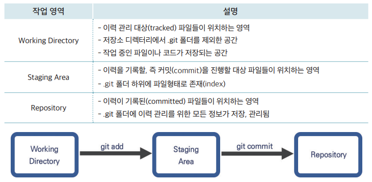
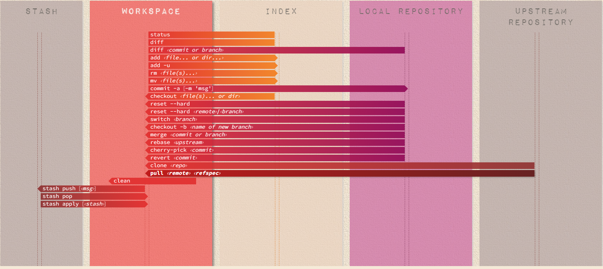
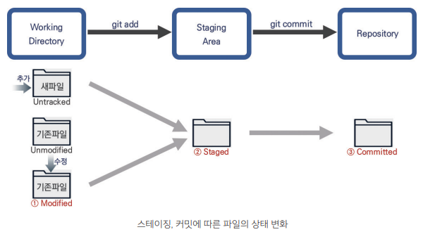

# 01. git

## 1. git 이란

- [VCS(Version Control System)란?](https://git-scm.com/book/ko/v2/%EC%8B%9C%EC%9E%91%ED%95%98%EA%B8%B0-%EB%B2%84%EC%A0%84-%EA%B4%80%EB%A6%AC%EB%9E%80%3F)
  - 로컬 버전 관리
  - 중앙 버전 관리: subversion(SVN)
  - 분산 버전 관리: [git](https://git-scm.com)

> 다른 VCS를 사용하던 경험이 있다면 이를 버려야 한다.   
> Git은 미묘하게 달라서 다른 VCS에서 쓰던 개념으로는 헷갈린다.   
> 사용자 인터페이스는 매우 비슷하지만, 정보를 취급하는 방식이 다르다.   
> [이런 차이점(차이vs스냅샷)](https://git-scm.com/book/ko/v2/%EC%8B%9C%EC%9E%91%ED%95%98%EA%B8%B0-Git-%EA%B8%B0%EC%B4%88)을 이해하면 Git을 사용하는 것이 어렵지 않다.

## 2. 설치

- [다운로드](https://git-scm.com/downloads)
- [window설치 가이드](https://parkjh7764.tistory.com/39)
- git 설치 확인
```sh
$ git --version
```

## 3. [GitHub Cheat Sheet](https://training.github.com/downloads/ko/github-git-cheat-sheet/)

- 환경 설정
```sh
# (.gitconfig) 확인
$ git config --list

# 사용자 설정
$ git config --global user.name "Yumi"
$ git config --global user.email "hyyumi2@gmail.com"

$ git config user.name
$ git config user.email

# 줄바꿈 설정 (Carriage Return, Line Feed)
# window(\r\n -> \n -> \r\n)
$ git config --global core.autocrlf true
# mac(\n -> \n -> \n)
$ git config --global core.autocrlf input
```

## 4. Git Workflow

> 이 부분은 Git을 공부하기 위해 반드시 짚고 넘어가야 할 중요한 부분이다.

  

  ||||
  |--|--|--|
  |Working Directory|= WORKSPACE|작업 디렉토리 
  |Staging Area|= INDEX|완료 대기
  |Repository|= LOCAL REPOSITORY|로컬 저장소
  ||= STASH|임시 저장소
  ||= UPSTREAM REPOSITORY|원격 저장소
  
  - [Visual Git Cheat Sheet](https://ndpsoftware.com/git-cheatsheet.html)
  


- ### 파일 상태



## 5. 명령어 실습

- 저장소 생성하기(init)
```sh
$ mkdir git-project
$ cd git-project
$ git init
$ ls -al
```
- 이력 만들기(status, diff, add, commit, log, show)
```sh
$ git status

# 파일을 생성합니다.
$ echo "# git-project" > README.md

# 작업 디렉토리 상태 확인: untracked상태의 파일
$ git status

# 파일을 스테이징(add)합니다.
$ git add README.md

# 작업 디렉토리 상태 확인: 스테이징 영역으로 이동
$ git status

# 스테이징하였으나 아직 커밋하지 않은 파일과 가장 최근에 커밋한 파일을 비교합니다
$ git diff --staged

# 로컬 저장소에 commit합니다.
$ git commit -m "add README.md"

# 작업 디렉토리 상태 확인: clean
$ git status

# 변경 기록 확인
$ git log

# 특정 커밋 변경사항 확인
# [commit]: 저장소에 커밋시 각각의 버전에 스냅샷된 정보를 기반으로 부과된 고유한 해시코드(40자)
$ git show [commit]

```

## 6. GUI Clients

- [다운로드](https://git-scm.com/downloads/guis)
- [Sourcetree](https://www.sourcetreeapp.com/)

```sh
$ echo "*.log" > .gitignore
# 소스트리 파일상태 확인

$ echo "test" > local.log
# .gitignore 적용으로 버전관리에서 제외됨

# .gitignore파일 스테이징
# .gitignore파일 수정
$ echo "logs/*" > .gitignore

$ git status
# 소스트리 파일상태와 비교

# 그외 소스트리를 이용하여 스테이지 올리기(add)/내리기(rm), 커밋, 파일비교(diff), 제거(remove), 폐기(discard), history 등을 실습
```

- [gitignore](https://github.com/github/gitignore)
