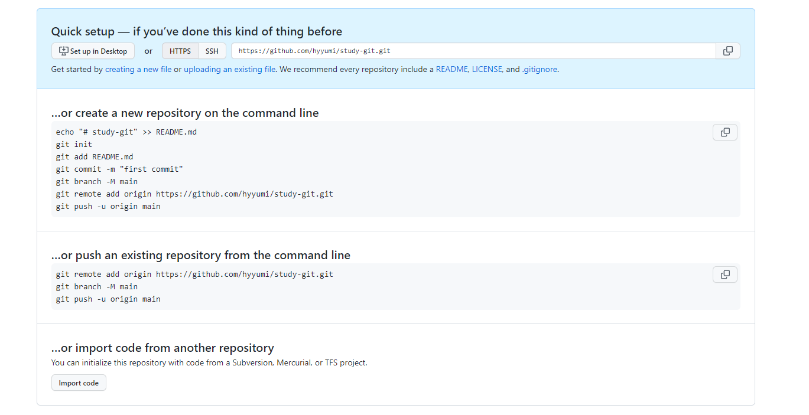
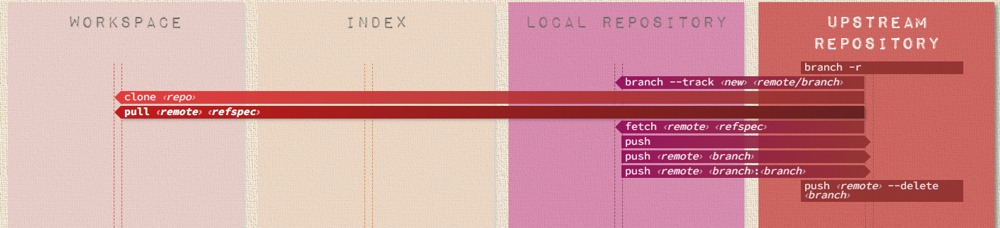

# 02. 원격저장소/github

- 리모트 저장소는 인터넷이나 네트워크 어딘가에 있는 저장소를 말한다.
- 대표적인 github는 코드 웹 호스팅 플랫폼으로 git 원격저장소뿐만 아니라 다양한 협업을 위한 기능들을 제공한다.

## 브랜치

> 개발을 하다 보면 코드를 여러 개로 복사해야 하는 일이 생길 수 있는데,  
> 이때 코드를 통째로 복사하고 나서 원래 코드와는 상관없이 독립적으로 개발할 수 있는게 브랜치입니다.  
> 일명 가지치기
  
> Git의 브랜치는 매우 가볍고 순식간에 브랜치를 새로 만들고 브랜치 사이를 이동할 수 있다.  
> 다른 버전 관리 시스템과는 달리 Git은 브랜치를 만들어 작업하고 나중에 Merge 하는 방법을 권장한다.  
> Git 브랜치에 능숙해지면 개발 방식이 완전히 바뀌게 됩니다.

- Learn Git Branching  
git 리포지토리 시각화 도우미 프로그램으로 git 명령에 익숙해지기 위해 다양한 수준의 게임을 제공하는 사이트.
  - [브랜치 데모](https://learngitbranching.js.org/?demo=&locale=ko)


## 협업 실습

- ### 원격 저장소 만들기


```sh
# 기본 브랜치명 변경
$ git config --global init.defaultBranch main
```

  

- ### 브랜치 명령어 실습
```sh
# 원격저장소 확인
$ git remote

# 브랜치 만들기
$ git branch <브랜치명>
# 브랜치 이동(새 브랜치 체크아웃)
$ git checkout <브랜치명>
# <파일 변경사항 만들기>

# 로컬 저장소에 저장
$ git add 
$ git commit -m "메시지"

# 원격 저장소에 저장
$ git push <저장소명> <브랜치명>

### github/git history로그 확인

# main 브랜치 이동
$ git checkout main
# 브랜치 병합(merge) - Fast Forward 방식
$ git merge <브랜치명>
# 푸시
$ git push <저장소명> <브랜치명>

# 브랜치 삭제
$ git branch -d <브랜치명>
```

- ### 원격 저장소 명령어 실습

  - 저장소 권한 부여하기: Settings > Collaborators > Manage access


```sh
# 원격 저장소 복제
$ git clone <저장소주소>
$ git clone <저장소주소> <폴더명>

# 브랜치 생성
# 브랜치 이동(새 브랜치 체크아웃)
# <파일 변경사항 만들기>

# 로컬 저장소에 저장
$ git add 
$ git commit -m "메시지"

# 원격 저장소에 저장
$ git push <저장소명> <브랜치명>

# 원격 저장소 기록 동기화
$ git fetch <저장소명>

# 원격저장소에서 현재 브랜치 이력 가져오기
$ git pull

```

- ### 명령어 별칭만들기
```sh
# 마지막 커밋 취소
$ git config --global alias.undo "reset --soft HEAD^"
# 마지막 커밋에 파일 추가
$ git config --global alias.amend "commit --amend --no-edit"
# 상태 요약
$ git config --global alias.st "status -sb"
# 로그 컬러 그래프
$ git config --global alias.lg "log --graph --pretty=format:'%Cred%h%Creset -%C(yellow)%d%Creset %s %Cgreen(%cr) %C(bold blue)<%an>%Creset'"
# 커밋랭킹
$ git config --global alias.rank "shortlog -n -s --no-merges"
```


## 브랜치 전략

- [브랜치 전략 수립을 위한 전문가의 조언들](http://blog.hwahae.co.kr/all/tech/tech-tech/9507/)

> 브랜치 전략에 정해진 정답은 없습니다.  

> 브랜치 전략에 대하여 깊이 고민하지 않았다면 Git-flow와 GitHub-flow만 워크플로우라 오해하기 쉽습니다. 해당 브랜치 전략들은 분명 워크플로우의 정수이지만, 만병통치약은 될 수 없습니다.  
> 따라서 조직에 어울리는 브랜치 전략을 고안할 때 주어진 여건이 무엇인지 정확히 인지해야 합니다. 만약 주어진 상황에 어울리는 전략이 없다면 상황에 맞게 새로운 플로우를 만드세요. 리소스를 낭비하면서 틀에 얽매일 필요는 없습니다. 

- ### 브랜치 전략 수립
|브랜치명|구분|설명|비고|
|--|--|--|--|
|feature|개발 브랜치|- 이슈 기반 기능 개발 브랜치<br/>- 개발 완료후 develop으로 PR||
|develop|개발 브랜치|- 기능 개발 완료 테스트 브랜치<br/>- 버저닝되어 main으로 merge||
|hotfix|임시 브랜치|- 운영중 긴급한 오류 수정을 위한 브랜치 from main||
|main|상용버전 브랜치|- 현재 배포된 버전의 브랜치||

- 동시에 여러 프로젝트를 진행한다면 develop대신 여러개으 release 브랜치를 만들어 제어한다.


## Pull Request, Issue

> PR은 보통 오픈소스 프로젝트에서 수정 권한이 없는 사람이 기여자로 참여하기 위한 방식으로 많이 알려져 있으며 프로젝트를 fork한후 새로운 브랜치에서 수정한 내역을 PR요청하여 merge하는 프로세스를 갖습니다.
* fork : github 개인 저장소에 복제, 원격 저장소가 2개가 되는 셈

<br/>

> 이슈 기반 브랜치 전략에서 ISSUE와 PR은 협업 업무의 체계라 할 수 있습니다.  
ISSUE를 작성하고 해당 feature 브랜치를 만들어 개발한 후 PR 요청하는 하나의 업무 프로세스를 갖게 됩니다.  
이때 ISSUE와 PR의 작성 형식은 템플릿화 하여 작성 규칙을 정해 놓을 수 있습니다.

- .github
  - PULL_REQUEST_TEMPLATE.md
  - ISSUE_TEMPLATE.md

## Action

- 소프트웨어 workflow를 자동화할 수 있도록 도와주는 도구
- Workflow의 대표적인 예
  1) Test Code  
  2) 배포
  3) 기타 자동화하고 싶은 스크립트
- [Gihub Action 사용법 정리](https://zzsza.github.io/development/2020/06/06/github-action/)


---

## 이슈, PR, 브랜치 전략 실습

## 질문